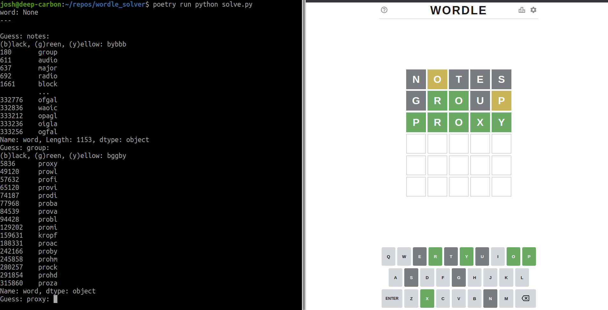

# Super Dumb Wordle Solver

---

[Wordle](https://www.powerlanguage.co.uk/wordle/) is word puzzle humans seem to like for some reason. Fuck knows why, word puzzles fuck with my brain. So I wrote this to help me look smart on ~~Facebook~~ Meta because we all know looking smart on social media is where it's at!.

1. `poetry run python solve.py`
2. Select start guess. Start words will never have duplicate chars and are samples according to the frequency of the char in englist. ToDo, determine frequency wrt the word list.
  - You can override it if you wish by typing a 5 letter world and hitting *enter*
3. Input score `(b)lack, (y)ellow, (g)reen` ie: bbyyg *enter*
4. The next suggestion will be sampled after filtering.
  - Hit *enter* to accept
  - Use *!* to select the next word, or
  - select from the list proveded and enter it manually then hit *enter*.
5. Repeat

# Requirements

- [PyPoetry](https://python-poetry.org/)

# Insall

`poetry install`

# References

- CSV data from [Rachael Tatman](https://www.kaggle.com/rtatman) on [Kaggle](https://www.kaggle.com/rtatman/english-word-frequency)  **Now used now, I use the list of words supported by wordel. I found them on reddit somewhere**
